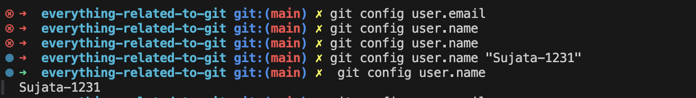

### Version Control System (VCS)

- A Version Control System (VCS) is a tool that helps developers manage changes to their code over time. It allows multiple versions of a project to exist simultaneously, making it easier to collaborate with others and maintain a record of all modifications.

### What is Version Control?

- Version control is a system that manages and tracks changes to files over time, allowing multiple people to collaborate on a project while maintaining a history of all modifications. It records changes to files, such as code, documents, or configuration files, and stores them in a repository. With version control, developers can revert to previous versions, compare differences between versions, and understand the evolution of a project. It supports features like branching, where different lines of development can occur independently, and merging, which combines changes from different branches. Overall, version control ensures that changes are organized, recoverable, and easily managed, making it a critical tool in software development and collaborative projects.

### Why use Version Control?

Using version control is essential for managing changes in software development, as it enables tracking of modifications, collaboration, and maintaining a history of your project. It allows multiple developers to work on the same codebase simultaneously without overwriting each other's work, providing a clear record of who made changes and why. Version control systems facilitate rollback to previous versions if issues arise, and they support branching and merging, which are crucial for experimenting with new features and managing different stages of development. Overall, version control ensures code quality, accountability, and efficient collaboration in projects.

### Git vs Other VCS

- Git has become the de facto standard for source control in software development, but it's not the only version control system (VCS) available. Here are some key differences between Git and other popular VCS:
- Mercurial: Mercurial is a distributed VCS that uses a similar architecture to Git. However, it has a more centralized approach and doesn't use hashes for tracking changes.
- Subversion: Subversion is a centralized VCS that's often compared to Git. While both systems support branching and merging, Subversion requires a central server to manage the repository.
- Perforce: Perforce is a commercial VCS that's designed for large-scale development projects. It uses a centralized approach and has features like build automation and issue tracking.
  CVS: CVS is an older version control system that's still in use today. However, it lacks many modern features and is often considered outdated.
- To know more we can read from here [git-vs-other-vcs-a-comparative-analysis](https://medium.com/@pascalchinedu2000/git-vs-other-vcs-a-comparative-analysis-5cb03ad58e0e)

### Installing Git Locally

- We can follow this for git installation [git-guides/install-git](https://github.com/git-guides/install-git)
- Once installed, you can verify the Git version by running git --version in your terminal

### What is a Repository

- A repository is a storage location for your project's code, documentation, and other files. It serves as a central hub for collaboration, version control, and code management. It allows multiple people to work on the same project without overwriting each other's work.
- To know more visit this [About repositories](https://docs.github.com/en/repositories/creating-and-managing-repositories/about-repositories)

### learn git branching

- [learngitbranching](https://learngitbranching.js.org/)

### git init

- The git init command creates a new Git repository. It can be used to convert an existing, unversioned project to a Git repository or initialize a new, empty repository. Most other Git commands are not available outside of an initialized repository, so this is usually the first command you'll run in a new project.
- We can follow this url to know more. [git init | Atlassian Git Tutorial](https://www.atlassian.com/git/tutorials/setting-up-a-repository/git-init)
- We can follow this url to know how to setup the repo thing [setting-up-a-repository](https://www.atlassian.com/git/tutorials/setting-up-a-repository)

### git config

- The git config command is a convenience function that is used to set Git configuration values on a global or local project level. These configuration levels correspond to .gitconfig text files. Executing git config will modify a configuration text file.

- The most basic use case for git config is to invoke it with a configuration name, which will display the set value at that name. Configuration names are dot delimited strings composed of a 'section' and a 'key' based on their hierarchy. For example: user.email

To know more we can visit here.. [setting-your-username-in-git](https://docs.github.com/en/get-started/git-basics/setting-your-username-in-git)

```js
# Check your Git username
git config user.name
# If it returns nothing, set your GitHub username
git config user.name "your-github-username"

# Verify the change
git config user.name
# This should now return your GitHub username (can see screenshot below)

# Note: The same applies for your email

# Check your Git email
git config user.email
# If it returns nothing, set the email associated with your GitHub account
git config user.email "your-email@example.com"

# Verify the change
git config user.email
# This should now return the email linked to your GitHub account

```



#### Why we generally do configure user.name and user.email in Git ?

- To Identify the author of each commit.
- Without setting user.name and user.email, Git won’t allow you to commit (in most cases), or it will use default/global settings, which might not match your GitHub account.

#### Multiple Accounts or Machines

- If you're using:
- Multiple GitHub accounts
- Shared or new machines
- You should set the correct user.name and user.email locally per repository, so your commits remain correctly attributed.

### Set Globally (for all repositories on your machine):

```js
git config --global user.name "Your Name"
git config --global user.email "your-email@example.com"
```

### Set Locally (for one specific repo):

```js
git config user.name "Your Name"
git config user.email "your-email@example.com"
```

### Local vs Global Config

- To manage local and global configuration settings, you can use the git config command with the --local and --global options.

- Local configuration: Run git config --local [key] [value] to set a local configuration setting for the current repository.
  Global configuration: Use git config --global [key] [value] to set a global configuration setting that applies to all repositories on your system.

- We can follow this to know more [step-by-step-guide-to-setting-up-git-config-global-properties](https://medium.com/geekculture/a-step-by-step-guide-to-setting-up-git-config-global-properties-db6dbce30fa8)

- [Customizing-Git-Git-Configuration](https://git-scm.com/book/en/v2/Customizing-Git-Git-Configuration)
